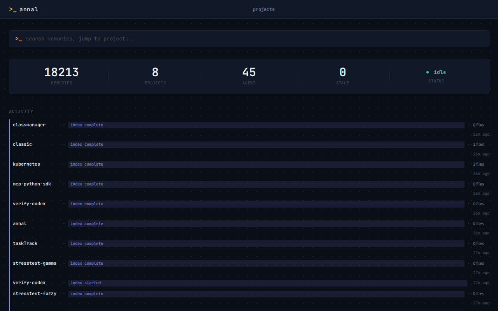
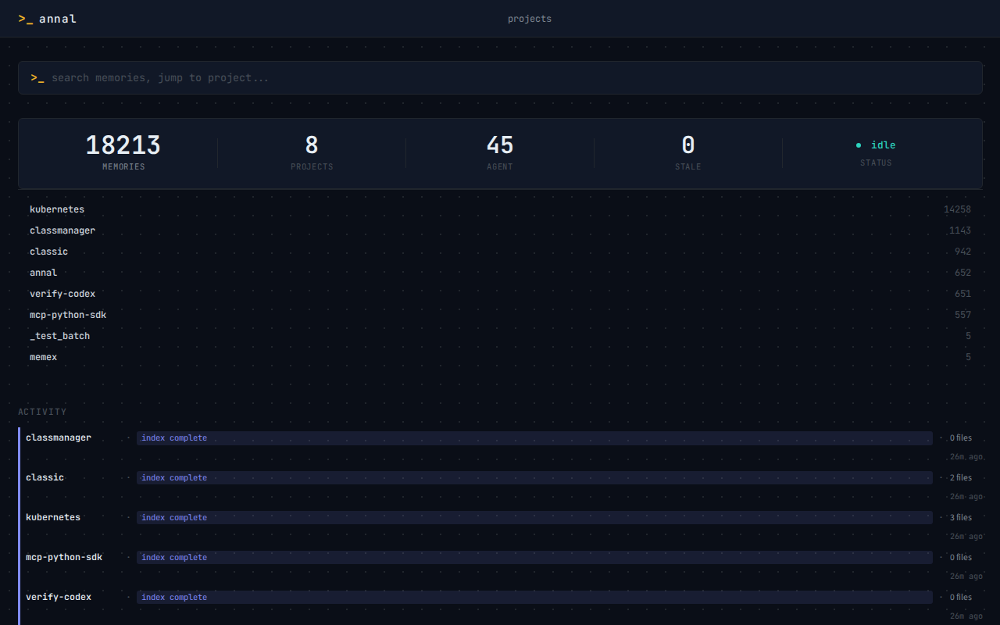
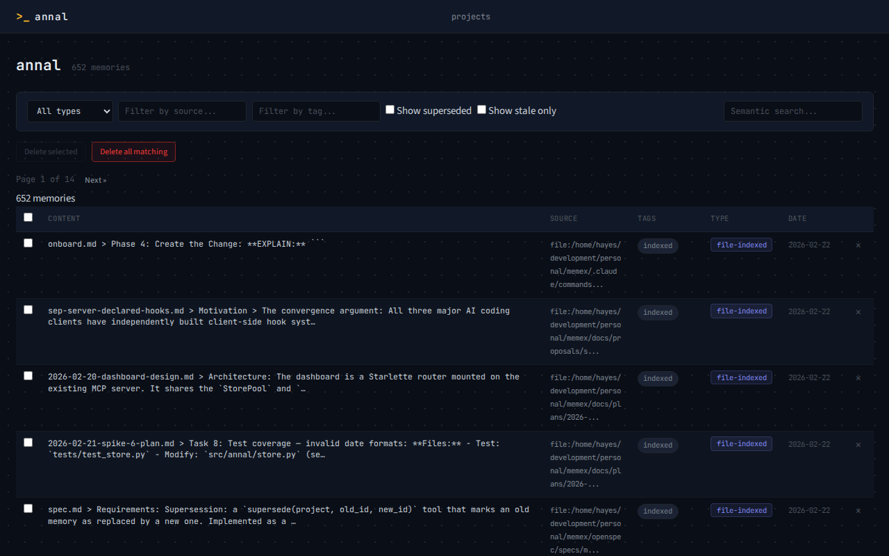
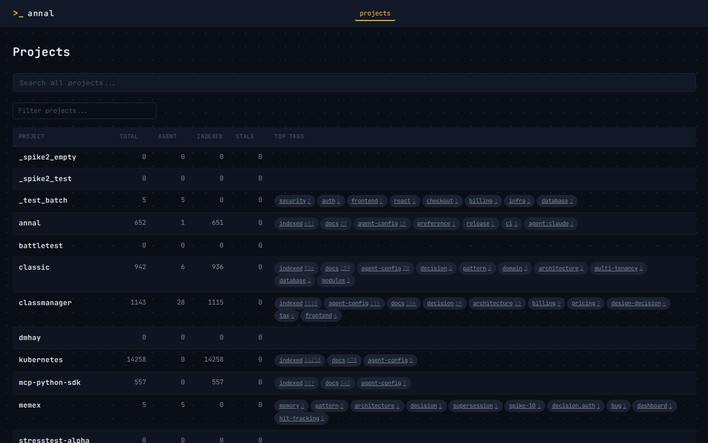

# Annal

*A tool built by tools, for tools.*

> Alpha — actively developed and used in production by the author across multiple projects. APIs and storage schemas are stabilising but may still change between minor versions. Bug reports and feedback welcome via [issues](https://github.com/heyhayes/annal/issues).

Semantic memory server for AI agent teams. Stores, searches, and retrieves knowledge across sessions using pluggable vector backends (ChromaDB or Qdrant) with local ONNX embeddings, exposed as an MCP server.

Designed for multi-agent workflows where analysts, architects, developers, and reviewers need shared institutional memory — decisions made months ago surface automatically when relevant, preventing contradictions and preserving context that no single session can hold.

## How it works

Annal runs as a persistent MCP server (stdio or HTTP) and provides tools for storing, searching, updating, and managing memories. Memories are embedded locally using all-MiniLM-L6-v2 (ONNX) and stored in a vector backend (ChromaDB by default, Qdrant optional), namespaced per project. When using Qdrant, hybrid search combines dense vector similarity with BM25 keyword matching via reciprocal rank fusion for better recall.

File indexing is optional. Point Annal at directories to watch and it will chunk markdown files by heading, track modification times for incremental re-indexing, and keep the store current via watchdog filesystem events. For large repos, file watching can be disabled per-project — agents trigger re-indexing on demand via `index_files`.

Indexing is non-blocking. `init_project` and `index_files` return immediately while reconciliation runs in the background. Agents poll `index_status` to track progress, which shows elapsed time and chunk counts.

Agent memories and file-indexed content coexist in the same search space but are distinguished by tags (`memory`, `decision`, `pattern`, `bug`, `indexed`, etc.), so agents can search everything or filter to just what they need.

A web dashboard (HTMX + Jinja2) runs alongside the server, providing a browser-based view of memories with search, browsing, bulk delete, and live SSE updates when memories are stored or indexing is in progress.

## Quick start

```bash
pip install annal

# One-shot setup: creates service, configures MCP clients, starts the daemon
annal install
```

Or from source:

```bash
git clone https://github.com/heyhayes/annal.git
cd annal
pip install -e ".[dev]"

# Run in stdio mode (single session)
annal

# Run as HTTP daemon (shared across sessions)
annal --transport streamable-http
```

`annal install` detects your OS and sets up the appropriate service (systemd on Linux, launchd on macOS, scheduled task on Windows). It also writes MCP client configs for Claude Code, Codex, and Gemini CLI.

## MCP client integration

### Claude Code

Add to `~/.mcp.json` for stdio mode:

```json
{
  "mcpServers": {
    "annal": {
      "command": "/path/to/annal/.venv/bin/annal"
    }
  }
}
```

For HTTP daemon mode (recommended when running multiple concurrent sessions):

```json
{
  "mcpServers": {
    "annal": {
      "type": "http",
      "url": "http://localhost:9200/mcp"
    }
  }
}
```

### Codex / Gemini CLI

`annal install` writes the appropriate config files automatically. See `annal install` output for paths.

## Agent configuration

For agents to actually use Annal, they need instructions that explain why it matters, not just how to call it. Add one of these snippets to your `CLAUDE.md`, `AGENT.md`, or equivalent agent instructions file.

### Recommended snippet

```xml
<annal_semantic_memory>
You have persistent semantic memory via Annal (mcp__annal__* tools). Memories survive across
sessions and are searchable by meaning. This is your long-term memory — MEMORY.md is a cheat
sheet, Annal is deep storage.

Why this matters: every session starts blank. Without Annal, you repeat investigations,
rediscover patterns, and miss prior decisions. With it, you inherit your past self's
understanding of the codebase.

When to search (use mode="probe" to scan, then expand_memories for details):
- Session start: load context for the current task area
- Unfamiliar code: before diving into a module you haven't seen this session
- "What happened" questions: anything about recent work, prior decisions, project state
- Before architectural changes: check for prior decisions in the same domain
- Familiar-feeling bugs: search for prior root causes

When to store (tag with type + domain, e.g. tags=["decision", "auth"]):
- Bug root causes and the fix that worked
- Architectural decisions and their rationale
- Codebase patterns that took effort to discover
- User preferences for workflow, tools, style
- Key file paths and module responsibilities in unfamiliar codebases

After completing a task, before moving on, always ask: what did I learn that I'd want to know
next time? If you discovered a root cause, mapped unfamiliar architecture, or found a pattern
that took effort — store it. This is the single most important habit for cross-session value.

Project name: use the basename of the current working directory.
</annal_semantic_memory>
```

### Minimal snippet

If you prefer something shorter:

```xml
<annal_semantic_memory>
You have persistent semantic memory via Annal (mcp__annal__* tools). Unlike MEMORY.md which
resets with context, Annal memories survive across sessions and are searchable by meaning.

This matters because you lose all context when a session ends. Annal is how you recover it.
Search before starting work — your past self may have already mapped the architecture,
debugged this module, or recorded a decision that saves you from repeating the investigation.

Search: at session start, when touching unfamiliar code, when the user asks "what did we
decide about X", and before proposing architectural changes. Use mode="probe" to scan cheaply.

Store: bug root causes, architectural decisions, codebase patterns, surprising discoveries —
anything you'd want to know if you started a fresh session tomorrow. Tag with a type
(decision, bug, pattern, memory) plus domain tags. After completing a task, always ask: what
did I learn? Store it before moving on.

Project name: use the basename of the current working directory.
</annal_semantic_memory>
```

## Project setup

On first use, call `init_project` with watch paths for file indexing, or just start storing memories — unknown projects are auto-registered in the config.

```
init_project(project_name="myapp", watch_paths=["/home/user/projects/myapp"])
```

Every tool takes a `project` parameter. Use the directory name of the codebase you're working in (e.g. "myapp", "annal").

## Tools

`store_memory` — Store knowledge with tags and source attribution. Near-duplicates (>95% similarity) are automatically skipped. When a similar memory is found (80-95% similarity), a hint suggests using the `supersedes` parameter to replace it. Pass `supersedes=<old_id>` to mark the old memory as replaced — it drops out of search but remains for audit.

`store_batch` — Store multiple memories in a single call. Each item takes the same fields as `store_memory` (`content`, `tags`, `source`, `supersedes`). More efficient than repeated `store_memory` when storing 2+ memories at once.

`search_memories` — Natural language search with optional tag filtering and similarity scores. Three output modes: `mode="summary"` (default) returns first 200 chars with metadata, `mode="probe"` returns compact one-line summaries for scanning large result sets, and `mode="full"` returns complete content. Optional `min_score` filter suppresses low-relevance noise. Tags use fuzzy matching (semantic similarity) so `tags=["auth"]` finds memories tagged `authentication`. Temporal filtering with `after` and `before` (ISO 8601 dates) scopes results by creation date. Optional `projects` parameter enables cross-project search (`projects="*"` searches all configured projects). Pass `include_superseded=True` to surface replaced memories. Returned results include `hit_count` and `last_accessed_at` for access tracking.

`expand_memories` — Retrieve full content for specific memory IDs. Use after a probe search to fetch details for relevant results.

`update_memory` — Revise content, tags, or source on an existing memory without losing its ID or creation timestamp. Tracks `updated_at` alongside the original.

`retag_memory` — Modify tags on an existing memory without changing content. Supports `add_tags`/`remove_tags` for incremental edits, or `set_tags` to replace all tags at once.

`delete_memory` — Remove a specific memory by ID.

`prune_stale` — Review and delete stale agent memories. Identifies memories with `last_accessed_at` older than `max_age_days` (default 60) and optionally those never accessed. Runs in `dry_run=True` mode by default, returning a summary of what would be deleted. Set `dry_run=False` to execute deletion. Only targets agent memories — file-indexed chunks are managed by the file watcher.

`list_topics` — Show all tags and their frequency counts.

`init_project` — Register a project with watch paths, patterns, and exclusions for file indexing. Indexing starts in the background and returns immediately.

`index_files` — Full re-index: clears all file-indexed chunks and re-indexes from scratch. Use after changing exclude patterns to remove stale chunks.

`index_status` — Per-project diagnostics: total chunks, file-indexed vs agent memory counts, stale and never-accessed memory counts, indexing state with elapsed time, and last reconcile timestamp.

## Configuration

`~/.annal/config.yaml`:

```yaml
data_dir: ~/.annal/data
port: 9200
projects:
  myapp:
    watch_paths:
      - /home/user/projects/myapp
    watch_patterns:
      - "**/*.md"
      - "**/*.yaml"
      - "**/*.toml"
      - "**/*.json"
    watch_exclude:
      - "**/node_modules/**"
      - "**/vendor/**"
      - "**/.git/**"
      - "**/.venv/**"
      - "**/__pycache__/**"
      - "**/dist/**"
      - "**/build/**"
  large-repo:
    watch: false          # disable file watching, use index_files on demand
    watch_paths:
      - /home/user/projects/large-repo
```

### Backend configuration

By default, Annal uses ChromaDB (local, file-based, no extra dependencies). To switch to Qdrant for native tag filtering, hybrid BM25+vector search, and concurrent write support, add a `storage` section:

```yaml
storage:
  backend: qdrant
  backends:
    qdrant:
      url: http://localhost:6333
      hybrid: true              # enable BM25 sparse vectors (default: true)
    chromadb:
      path: ~/.annal/data       # kept for migration
```

Install the Qdrant client dependency: `pip install annal[qdrant]`

To migrate existing data between backends: `annal migrate --from chromadb --to qdrant --project myapp`

### Export / Import

Back up and restore memories as JSONL:

```bash
annal export --project myapp > backup.jsonl
annal import --project myapp backup.jsonl
```

## Running as a daemon

The recommended approach is `annal install`, which sets up the service for your OS automatically.

For manual setup, use the service scripts in `contrib/`:

### Linux (systemd)

```bash
cp contrib/annal.service ~/.config/systemd/user/
# Edit ExecStart path, then:
systemctl --user daemon-reload
systemctl --user enable --now annal
```

### macOS (launchd)

```bash
cp contrib/com.annal.server.plist ~/Library/LaunchAgents/
# Edit the ProgramArguments path, then:
launchctl load ~/Library/LaunchAgents/com.annal.server.plist
```

### Windows (scheduled task)

```powershell
.\contrib\annal-service.ps1 -Action install -AnnalPath "C:\path\to\annal\.venv\Scripts\annal.exe"
Start-ScheduledTask -TaskName "Annal MCP Server"
```

## Dashboard

When running as an HTTP daemon, the dashboard is available at `http://localhost:9200`. It provides a terminal-inspired interface for browsing and managing memories across all projects.



The landing page features a command palette for quick navigation, a stats ribbon that expands to show per-project breakdowns when clicked, and a live activity feed with SSE updates as memories are stored, deleted, or indexing runs.



The memories view provides browsing with pagination and filters (by type, source, tags), semantic search with cross-project support, expandable content previews, bulk delete by selection or filter, a "Show superseded" toggle for viewing replaced memories, and a "Show stale only" filter that surfaces memories not accessed in 60+ days.



The projects page shows all registered projects with memory counts broken down by type, stale counts, and top tags rendered as clickable pills that jump to filtered memory views.



Disable with `--no-dashboard` if not needed.

## Changelog

See [CHANGELOG.md](CHANGELOG.md) for release history.

## Development

```bash
pip install -e ".[dev]"
pytest -v
```

275 tests cover store operations, search, hit tracking, stale detection, supersession, batch storage, indexing, file watching, dashboard routes, SSE events, CLI installation, export/import, migration, and a shared backend conformance suite that runs against both ChromaDB and Qdrant.

## License

MIT — see [LICENSE](LICENSE).
